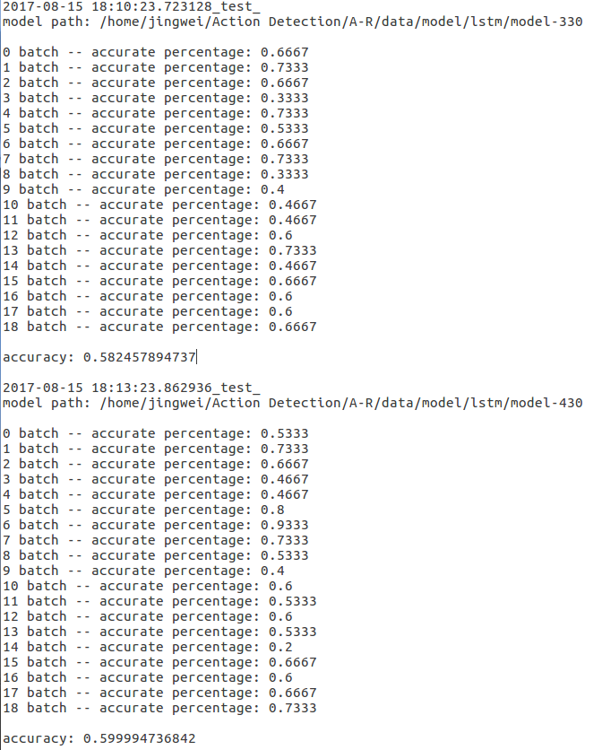
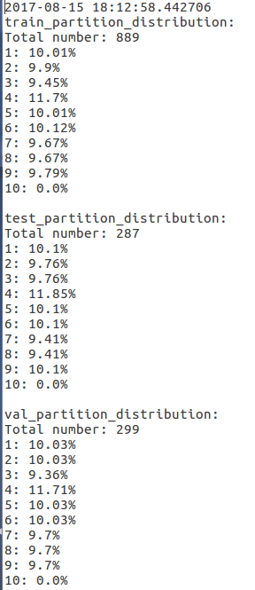
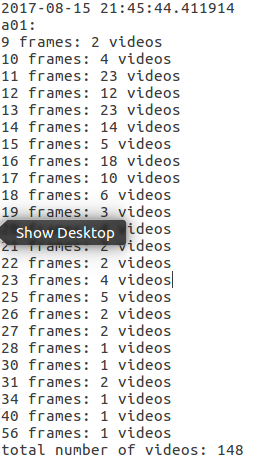

# Action_Recognition_using_Visual_Attention

<b>Update (August 13, 2017)</b> TensorFlow Implementation of [Action Recognition using Visual Attention](https://arxiv.org/abs/1511.04119) which introduces an attention based action recognition discriminator. The model inputed with a video will shifts its attention along the frames, labels each frame, and selects the merging label with the highest frequency of occurance as the fina label of the video.

<br/>


## References

Author's Theano implementation: https://github.com/kracwarlock/action-recognition-visual-attention

Show, Attend and Tell: Neural Image Caption Generation with Visual Attention: https://arxiv.org/abs/1502.03044

Show, Attend and Tell's Tensorflow implementation: https://github.com/yunjey/show-attend-and-tell

Used Data: http://users.eecs.northwestern.edu/~jwa368/my_data.html

<br/>


## Start

### Prerequisites

First, clone this repository and download the video data experimented in this project.

```bash
$ git clone https://github.com/Adopteruf/Action_Recognition_using_Visual_Attention
$ wget users.eecs.northwestern.edu/~jwa368/data/multiview_action_videos.tgz
```

unzipping the download video data and copying it into '/data/image/' can be conducted manually.
This code is written in Python2.7 and requires Tensorflow. Besides, there are several package and files needed to be install. Running the command below can help to download the necessary tools and download the <i>VGGNet19</i> model in 'data/' directory.

```bash
$ cd Action_Recognition_using_Visual_Attention
$ pip2 install -r Needed_Package.txt
$ sudo add-apt-repository ppa:kirillshkrogalev/ffmpeg-next
$ sudo apt-get update
$ sudo apt-get install ffmpeg
$ wget http://www.vlfeat.org/matconvnet/models/imagenet-vgg-verydeep-19.mat -P data/
```


For breaking the download videos into images along the frames and distribute them into three partitions including 'train/', 'val/', and 'test/' following the proporation: 0.6:0.2:0.2.
	
```bash
$ python pre-data.py
```

Then, we need to extract the features from the images prepared for the further training.

```bash
$ python CNN.py
```

<br/>


### Training
Run the command below to train the action recognition model.

```bash
$python train.py

```

After enter this command, the model will be trained based on the 'train' data-set and the whole models saved during the training process will be examed based on 'val' data-set. The user can pick the model with highest performance and exam it based on 'test' data-set.

Here is an experimental case.

#### models validated based 'val/' data-set


<br/>

#### models tested based on 'test/' data-set



<br/>


<br/>


### Tensorboard visualization

--update later

<br/>


### Results

--update later

<br/>

### Reminder

Besides, the codes: Data_Scanning.py and Image_Scanning.py can help to measures the data distribution of the corresponding data-set.
For example,

```bash
$ python Data_Scanning.py
```

#### three_data_partition_distribution



```bash
$ python Image_Scanning
```

<br/>

#### Video_Frames_Distribution



<br/>


<br/>


<br/>
